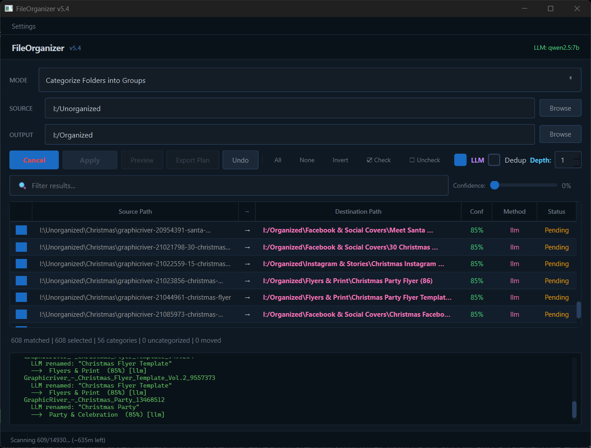

# FileOrganizer


> Hybrid file organizer for Windows. A C# / .NET 8 / WinUI 3 desktop shell
> drives a Python core that handles AI classification (DeepSeek, GitHub
> Models, Ollama), six cleanup scanners, progressive hash + perceptual
> dedup, EXIF-aware photo workflows, and explicit 3D asset metadata routing.



## What's in this repo

```
src/FileOrganizer.UI/   ← C# / .NET 8 / WinUI 3 desktop shell
fileorganizer/          ← Python core (legacy PyQt6 GUI + library code)
*.py at repo root       ← CLI runners + NDJSON sidecars (organize_run, cleanup_run, asset_db, ...)
```

The shell exists to replace the legacy PyQt6 GUI with a UCX-style
side-tab `NavigationView` and tile dashboard, while keeping every line of
the AI / dedup / photo logic in Python where the ecosystem lives. The
two halves talk over `stdout` (text or NDJSON). The legacy PyQt6 GUI
keeps working in parallel until the shell reaches feature parity.

| Shell page | Current role | Integration |
|---|---|---|
| Home | Dashboard and workflow navigation | Native shell |
| Smart Sort | Preview or apply type-aware routing from one or more source folders | `smart_run.py` |
| Organize | Preview, plan, apply, undo, and provenance | `organize_run.py`, `provenance_run.py` |
| Files | Preview or apply extension-based routing | `files_run.py` |
| Cleanup | Read-only streamed scan and persisted review | `cleanup_run.py` |
| Duplicates | Read-only exact/perceptual scan and persisted review | `dedup_run.py` |
| Music | Preview or apply music metadata organization | `music_run.py` |
| Video | Preview or apply video metadata organization | `video_run.py` |
| Books | Preview or apply e-book metadata organization | `books_run.py` |
| Fonts | Preview or apply font metadata organization | `fonts_run.py` |
| Source Code | Preview or apply project-aware routing | `code_run.py` |
| Subtitles | Preview or apply subtitle matching | `subtitles_run.py` |
| Photos | Preview or apply EXIF-aware organization | `photos_run.py` |
| Raw Photos | Preview/apply RAW metadata organization or save a non-destructive DNG copy | `raw_run.py` |
| Comics | Preview or apply comic metadata organization | `comics_run.py` |
| Watch | Configure watches and stream live or logon-started events | `watch_run.py`, `watch_task_run.py` |
| Toolbox | Run explicit maintenance and reporting commands | Python CLI tools |
| Settings | Theme, defaults, and credential settings | Native shell services |

Current shell boundaries:

- Cleanup and Duplicates are deliberately read-only review surfaces. Use the
  Python desktop tools for destructive actions such as Trash, quarantine,
  hard-link, move, and undo.
- The self-contained .NET shell still needs the Python runtime and packages
  described below because workflow pages launch local Python sidecars.
- Background Watch startup is opt-in under **Settings → Watch Mode**. It
  registers a hidden, least-privilege per-user Task Scheduler entry and keeps
  one bounded rollover log; removing or disabling the task is available from
  the same panel.
- Portable deployments can place an empty `portable.flag` beside the Python
  entry point or packaged executable. Settings, databases, caches, and logs
  then live under the neighboring `FileOrganizerData` directory instead of
  `%APPDATA%\FileOrganizer`.
- The optional CLIP visual index is local-only and fail-closed. Install the
  heavyweight ML stack separately, then use `clip_index_run.py` to build a
  ViT-L-14 / sqlite-vec image index or query nearest visual matches.
- `chroma_run.py` provides the same opt-in CLIP vectors through a persistent
  local Chroma collection, including image-to-image and text-to-image search.
- `vlm_run.py` provides an opt-in local Qwen2.5-VL path through an installed
  llama.cpp Qwen multimodal CLI. It accepts user-supplied GGUF/mmproj files,
  emits OCR/classification evidence over NDJSON, and fails closed when the
  binary is unavailable; it never downloads models or sends files remotely.
- Set `FILEORGANIZER_LLAMA_SERVER_URL` to a loopback `llama-server` endpoint
  to enable prompt-prefix KV-cache reuse for Ollama-compatible batch
  classification. The cache is invalidated when the model, system prompt, or
  `FILEORGANIZER_LLM_CONTEXT_REVISION` changes; Ollama remains the fallback.
- Structured audit events are written locally to
  `%APPDATA%\FileOrganizer\logs\audit.jsonl`. Move, classify, and dedup
  operations carry bounded trace IDs with redacted error fields; Loguru is
  used when installed and a stdlib-compatible fallback preserves the same
  JSONL contract. Prompts, credentials, and classification payloads are not
  recorded.
- Optional Prometheus metrics are disabled by default. Enable **Settings →
  Enable local metrics export** to expose performance counters and histograms
  only at `http://127.0.0.1:9999/metrics`; the exporter never binds a public
  interface or sends telemetry remotely.

## Get FileOrganizer

Two install paths, pick the one that fits.

### Path A — WinUI 3 shell preview (recommended for new users)

Grab the latest release zip from
[Releases](https://github.com/SysAdminDoc/FileOrganizer/releases) (look
for `ui-v*` tags) and extract it anywhere.

```
shell\FileOrganizer.exe   ← double-click to launch
organize_run.py · cleanup_run.py · fileorganizer\ · requirements.txt
```

The shell is self-contained for .NET 8, but the live pages still call
into Python — install Python 3.10+ on PATH (or drop a
`.venv\Scripts\python.exe` next to the scripts at the extract root, or
set `%FILEORGANIZER_PYTHON%`), then once:

```pwsh
python -m pip install uv pip-audit
uv pip install --system --require-hashes -r requirements.lock
```

AI classification provenance is written to same-basename `.xmp` sidecars when
ExifTool 12.15+ is installed on `PATH`. The pinned `PyExifTool==0.5.6`
wrapper is included in the lock. Sidecar writing is optional and fail-closed:
missing or failed tooling never blocks a move. Keep the `.xmp` companion beside
its asset when copying a library; `robocopy /COPYALL` preserves NTFS metadata
for both files, but does not discover a sidecar that was omitted from the copy.

`requirements.lock` is the hash-pinned Windows x64/Python 3.10 release
baseline. When `requirements.txt` changes, regenerate and verify it with:

```pwsh
uv pip compile --generate-hashes --python-version 3.10 --python-platform x86_64-pc-windows-msvc --output-file requirements.lock requirements.txt
python verify_dependencies.py --check --validate --audit
```

### Path B — Python core only (legacy PyQt6 GUI + CLI)

```bash
git clone https://github.com/SysAdminDoc/FileOrganizer.git
cd FileOrganizer
python -m pip install -r requirements.txt
python run.py        # opens the PyQt6 GUI; Ollama setup is explicit
```

Application startup never installs packages or modifies the active Python
environment. The app checks the local Ollama setup, but it will not download or
execute an Ollama installer and will not pull a model automatically. Install
Ollama from the [official download
page](https://ollama.com/download), then open **Settings → Ollama LLM** and
use **Pull Model** or **Model Manager** as an explicit, visible action.

## Build the WinUI 3 shell from source

```pwsh
pwsh src/build.ps1                         # Debug build
pwsh src/build.ps1 -Configuration Release  # Release build
```

The script discovers a compatible Visual Studio MSBuild installation (or uses
`MSBUILD_EXE_PATH`) because bare `dotnet build` against the .NET 10 SDK fails
on the WindowsAppSDK 1.5 AppX/PRI task path. It
also cleans `obj/` + `bin/` first and runs `Restore` and `Build` as
separate invocations to avoid a known MarkupCompilePass2 cascade.

Output: `src/FileOrganizer.UI/bin/x64/Debug/net8.0-windows10.0.19041.0/FileOrganizer.exe`.

### Development checks

Install the pinned development tools, then run the same Python and service
contracts used by Windows CI:

```pwsh
python -m pip install -r requirements-dev.txt
python -m pytest -q
python quality_gate.py
dotnet run --project tests/SidecarProtocol.ContractTests/SidecarProtocol.ContractTests.csproj --configuration Release
```

`quality_gate.py` checks Ruff, mypy, and pyright against
`quality-baseline.json`. Existing findings are explicit technical debt: any
increase fails, and any decrease also requires lowering the checked-in
baseline so improvements cannot be lost. Reports are written under the ignored
`artifacts/quality/` directory by default.

## Major workflows

### Design Asset Organization (the original use case)

Sort thousands of marketplace downloads (Envato, Creative Market, Freepik)
into a clean category tree. The LLM reads folder + filenames, strips
marketplace junk, and picks from 384+ built-in categories.

**Before:**
```
Downloads/
├── GraphicRiver - Neon Night Club Party Flyer Template 28394756/
├── CM_elegant-wedding-invitation-set_4829173/
├── christmas-slideshow-after-effects-21098345/
└── ... 2,000 more like this
```

**After:**
```
Organized/
├── After Effects - Slideshows/
│   └── Christmas Slideshow/
├── Print - Flyers & Posters/
│   └── Neon Night Club Party Flyer/
├── Print - Invitations & Events/
│   └── Elegant Wedding Invitation Set/
└── ...
```

Drive it from the **Organize** page in the shell, or directly from the
CLI runner — see [CLI Batch Runner](#cli-batch-runner) below.

### Cleanup

Six progressive scanners, all wired into the **Cleanup** page in the shell
(or callable as `python cleanup_run.py --scanner <name> --root <path>`):

| Scanner | What it finds |
|---|---|
| Empty folders | Recursively-empty directory trees, deepest-first |
| Empty files | Zero-byte files |
| Temp / junk | `.tmp`, `.bak`, `Thumbs.db`, `~$*`, `.DS_Store`, partial downloads |
| Broken / corrupt | Magic-byte mismatches + optional ZIP/TAR integrity check |
| Big files | Files above a configurable MB threshold |
| Old downloads | Files not accessed in N days at the top of a folder |

Results stream live as items are discovered. Cancellation kills the child
Python process tree.

### Duplicates, Photos, Watch

- **Progressive hash dedup** — Size > prefix hash > suffix hash > full
  SHA-256, plus Pillow 12.2-compatible perceptual image hashing for
  near-duplicate photos. Interrupted scans save bounded stage hashes in
  `dedup_checkpoints.db` under the app-data directory and reuse them when the
  same files (including size and modification time) are scanned again.
- **Cross-library folder dedup** — The legacy desktop **Tools → Cross-Library
  Dedup** dialog compares independent roots (for example, `G:\Organized` and
  `I:\Organized`) using complete folder SHA-256 fingerprints. Each group lets
  you choose a keeper and explicitly leave, merge, or archive other copies;
  unreadable folders and changed scan results fail closed.
- **Version-aware dedup** — **Tools → Version-Aware Dedup** groups differing
  folder fingerprints that share a marketplace ID, proposes the fullest folder
  as keeper, and shows the file-count/version reason before archiving selected
  older versions. Both the keeper and archive candidate are revalidated first.
- **Browse reclassification** — **Tools → Browse Library** displays category
  folders as drop targets. Drag an asset folder between categories to perform a
  journaled move and store an exact-fingerprint correction in `corrections.json`;
  future scans can apply that correction before AI, and the SQLite cache tracks
  the `user_corrections` count.
- **Virtual bundles** — Browse can create named, non-destructive virtual folders
  that group asset fingerprints across categories. Add or remove selected assets
  without moving them; memberships live in `asset_bundles.db` and resolve again
  after an asset is moved within the library.
- **Audio waveform preview** — selecting an asset folder in Browse shows a
  bounded cached waveform for its first audio file. WAV/AIFF decode through the
  standard library; `soundfile` or `ffmpeg` extends support to compressed formats.
- **Shell Cleanup and Duplicates pages** — read-only review screens that do
  not mutate files. Use the Python desktop Cleanup Tools or Duplicate Finder
  for confirmation, Trash/quarantine, hard-link, move, and undo actions.
- **Resumable cleanup and duplicate reviews** — each shell scan is saved under
  a review ID and can be reopened, exported, or imported. Reopened paths are
  checked for existence, size, modification time, and exact-duplicate hash;
  changed or missing entries are labeled stale and excluded from actions.
- **Capability preflight** — the shell checks every workflow at startup and
  exposes package/tool versions, scope, online requirements, availability, and
  remediation. An unavailable extractor is reported as not checked, never as
  a clean scan; run `python capabilities_run.py` for the same matrix as NDJSON.
- **Replayable AI provenance** — each DeepSeek batch decision carries a stable
  evaluation ID through the move plan, journal, and report. The durable store
  retains fingerprints and hashes—not prompts, responses, API keys, file names,
  or paths—and the Organize page can review counts or export redacted JSONL.
- **IPTC 2025.1 AI sidecars** — successful file applies write the AI system,
  classification evidence, writer, subject keywords, confidence rating, and
  Adobe-compatible category to a same-basename `.xmp` sidecar when ExifTool is
  available. The original asset is never rewritten.
- **Adaptive corrections** — category overrides in the legacy rename/review
  workflow are remembered by exact folder fingerprint. Exact matches bypass AI
  on later scans, while keyword-related corrections become bounded few-shot
  examples for DeepSeek and Ollama without exposing paths in prompts.
- **Custom keyboard shortcuts** — the legacy desktop Settings menu exposes
  validated shortcuts for source selection, scanning, applying, previewing,
  undo history, and opening the destination. Overrides are stored in
  `%APPDATA%\FileOrganizer\keyboard_shortcuts.json` and can be reset per action.
- **Hazel-style automation rules** — the legacy desktop Settings menu includes
  a visual nested IF/AND/OR/THEN editor. Matching skip, move, and rename actions
  are translated into the same editable, boundary-validated move plan used by
  normal organization, so preview, journaling, and undo remain intact.
- **Plan-first desktop apply** — Preview and all three legacy desktop apply
  modes open the same preflight operation table. Every rename or move can be
  toggled independently, and the enabled state is saved as an editable JSON
  plan before any filesystem operation starts.
- **Batch rename preview** — the desktop organizer exposes a category-filtered
  inline preview with editable canonical names (`{CAT_CODE}_{ID}_{CLEAN_NAME}`)
  for pending folder/file plans. The CLI keeps renaming opt-in with
  `organize_run.py --rename` and supports `--rename-template`.
- **Photos** — EXIF metadata, Leaflet geotag map, AI event clustering,
  optional face detection, thumbnail grid.
- **RAW/DNG workflow** — `raw_run.py` identifies supported camera RAW files
  with ExifTool when available and falls back to a bounded extension allowlist.
  `--convert-dng` writes a new DNG through ImageMagick without deleting or
  overwriting the source; `--archive-root` places collision-safe copies under
  `raw_originals/YYYY/YYYY-MM-DD/Camera/` and attempts an optional XMP
  classification sidecar.
- **Watch mode** — monitor configured sources, debounce new files, write
  dry-run organize plans, persist state in `watch_state.db`, and recover
  supported NTFS changes that occurred while the watcher was stopped. The
  shell can also start its configured source/destination pairs at user logon,
  tune the 2–120 second quiet window, and inspect the bounded background log.
- **Scheduled profiles** — register saved scan profiles from **Settings →
  Schedules** or the CLI. Per-user tasks run offscreen through Windows Task
  Scheduler (with launchd/systemd support in the Python core), retain run
  status and bounded logs, and remain preview-only unless auto-apply is
  explicitly enabled. Auto-apply saves and validates an operation plan before
  moving or renaming anything.

These workflows work today through `python -m fileorganizer` (Path B) and the
shell sidecars where noted above.

## CLI Batch Runner

```bash
# AE pipeline (I:\After Effects → G:\Organized)
python organize_run.py --stats                    # Show all classified batches
python organize_run.py --preview --quiet          # Dry run
python organize_run.py --apply --quiet            # Apply all moves
python organize_run.py --retry-errors             # Retry failed items

# Design pipeline (G:\Design Unorganized → G:\Organized)
python organize_run.py --source design --preview --quiet
python organize_run.py --source design --apply --quiet
python organize_run.py --source design --skip-unchanged --dry-run
python organize_run.py --invalidate-cache             # Clear re-scan fingerprints
python organize_run.py --source design --parallel --dry-run
python organize_run.py --source design --preview --rules-file rules.json
python organize_run.py --source design --preview --no-rules
python organize_run.py --source design --preview --rename --quiet

# Watch configured source and emit dry-run plans for arriving files
python -m fileorganizer.watch_mode --source design --start --duration 60

# Inspect the per-user background Watch task configured by the shell
python watch_task_run.py --status

# Optional CLIP image index (install open_clip_torch, torch, and sqlite-vec first)
python clip_index_run.py --root Pictures --db .fileorganizer-clip.db
python clip_index_run.py --query Pictures/example.jpg --db .fileorganizer-clip.db

# Optional Chroma cross-modal index (also install chromadb)
python chroma_run.py --root Pictures --db .fileorganizer-chroma
python chroma_run.py --query-text "sunset over mountains" --db .fileorganizer-chroma

# Optional local Qwen2.5-VL/llama.cpp OCR and classification
python vlm_run.py --root Pictures --model models\qwen2.5-vl-7b-q4_k_m.gguf --mmproj models\mmproj.gguf

# Register and inspect a saved scan profile (preview-only by default)
python -m fileorganizer --schedule "Daily Inbox" --schedule-time 07:30
python schedule_task_run.py --status
python schedule_task_run.py --logs "Daily Inbox"

# Explicit unattended apply; use only after reviewing the profile's routes
python -m fileorganizer --schedule "Daily Inbox" --schedule-time 07:30 --auto-apply

# Plan-first apply (older --preview/--plan-out/--apply-plan aliases remain valid)
python organize_run.py --source design --dry-run --plan-file plan.json
python organize_run.py --plan-file plan.json --commit
python organize_run.py --report <RUN_ID> --output report.md

# Inspect, export, or replay privacy-redacted AI evaluation records
python provenance_run.py --stats
python provenance_run.py --export
python provenance_run.py --replay records.jsonl --fixtures decisions.jsonl

# Undo
python organize_run.py --undo-last 10
python organize_run.py --undo-all

# Validate sources
python organize_run.py --validate

# Save one camera RAW as a DNG without changing the source
python raw_run.py --convert-dng Pictures\RAW\frame.cr3 --output Pictures\DNG\frame.dng

# Archive a DNG copy with optional metadata/XMP sidecar
python raw_run.py --convert-dng Pictures\RAW\frame.cr3 --archive-root Archives
```

## Community Fingerprint Database

```bash
python asset_db.py --build G:\Organized          # Hash every file → SQLite DB
python asset_db.py --build G:\Organized --incremental  # Resume NTFS USN cursor
python asset_db.py --usn-status G:\Organized     # Check cursor, lag, and map size
python asset_db.py --stats                       # DB summary
python asset_db.py --export                      # asset_fingerprints.json
python asset_db.py --lookup "path/to/folder"     # Look up a folder
```

Match locally-downloaded templates against a community-curated catalog of
already-classified assets by SHA-256 — get clean names and categories
instantly without an AI API call.

The first incremental catalog run performs a full scan and saves the journal
identity and cursor. Later runs process only changed, created, renamed, or
deleted asset roots. Journal wrap, volume replacement, unavailable journal
access, network paths, and non-NTFS filesystems automatically rebuild or use
the existing full-scan path; the checkpoint advances only after a clean index
update.

Startup catalog checks are offline-first: network failures keep the last local
catalog available. Updates are accepted only from this repository's GitHub
release asset after its published SHA-256 digest and bounded schema validate,
then imported through a staged SQLite database with a last-known-good backup.
Use **Design Workflow Settings** to disable startup updates or view the last
successful catalog release and sync status.

## Configuration

### Interface language

The legacy PyQt desktop interface follows the system locale and ships English
and Simplified Chinese catalogs. To override the detected locale for a
session, set `FILEORGANIZER_LOCALE`, for example
`FILEORGANIZER_LOCALE=zh_CN python -m fileorganizer`. Catalogs are editable
JSON under `locale/`; release builds load the matching Qt `.qm` catalog and
fall back to the JSON catalog when a compiled catalog is unavailable.

Interactive controls receive accessible names and descriptions from their
visible labels/tooltips, visible panels get a deterministic Tab order, and
focused buttons can be activated with Enter.

### AI Providers

| Provider | Use | Model |
|---|---|---|
| DeepSeek | Heavy classification batches | `deepseek-v4-flash` |
| GitHub Models | Fast lightweight checks | `Anthropic/claude-3-5-haiku-20241022` |
| Ollama | Local / offline fallback | Any local model |
| llama.cpp Qwen2.5-VL | Explicit local OCR/diagram fallback | User-supplied Qwen2.5-VL GGUF + mmproj |

Set `DEEPSEEK_API_KEY` to enable DeepSeek routing.
Marketplace enrichment can use the optional `FREEPIK_API_KEY` for authenticated
Freepik resource metadata; Motion Array, FilterGrade, Shutterstock, Adobe Stock,
and Creative Market page lookups remain credential-free and fail closed when a
provider page is unavailable.
GitHub Models and DeepSeek use the shared `httpx` chat-completions transport.
The AI Provider settings dialog stores bounded parallel defaults (1–8 requests,
1–60 folders per request). Use `classify_design.py --run --parallel` directly,
or `organize_run.py --source design --parallel` to classify pending batches
before building the move plan; both accept `--concurrency` and
`--request-batch-size` overrides.

### Local OCR

The legacy desktop **Settings → Ollama LLM → Local OCR** controls optionally
run Tesseract on screenshot/scan images and scanned PDFs during import. OCR is
local-only, bounded, and treated as untrusted file data before it is sent to a
local LLM. Install [Tesseract OCR](https://github.com/tesseract-ocr/tesseract)
for image OCR; scanned-PDF OCR additionally needs Poppler's `pdftoppm`.
Use `FILEORGANIZER_TESSERACT` or `FILEORGANIZER_PDF_RENDERER` when the binaries
are not on `PATH`. Missing optional tools fail closed and do not affect normal
metadata extraction.

### Windows Explorer context menu

On Windows, use **Settings → Register Shell Extension** to add both GUI and
headless actions to Explorer folder menus. **Organize with FileOrganizer** opens
the normal review window for the selected folder. **Organize and Apply with
FileOrganizer** runs the configured rule-based/LLM scan offscreen, writes the
same guarded operation plan used by scheduled runs, and applies it. The
headless action honors `--dry-run` when launched from the command line; both
actions use the saved category destinations and never require a system-wide
registry change.

Manual category changes and the rename dialog's **Correct Category** action are
saved as adaptive corrections. An unchanged folder is classified from its
fingerprint before cache, metadata, marketplace, embeddings, or provider work;
similar names contribute deduplicated examples to subsequent AI prompts.

### Browse search

Browse includes a local SQLite FTS5 index over organized folders and files.
Search accepts ordinary phrases plus `category:...` and `type:file|folder`
filters, ranks matches with BM25, and displays citation-ready local paths and
move-time AI descriptions. Use **Reindex** after changes made outside the app;
the index never leaves the local app-data directory.

### ComfyUI / Automatic1111 outputs

The built-in **Category Presets → AI Art — ComfyUI / A1111** preset adds
Landscape, Portrait, Square, and Other destinations for Stable Diffusion and
Flux renders. The scanner also recognizes A1111 `parameters` chunks and
ComfyUI `prompt`/workflow metadata without executing workflow JSON. It keeps
bounded prompt, checkpoint/model hash, sampler, seed, steps, CFG, and image
dimensions as local evidence; ordinary photos without generation metadata are
not routed into the AI-art categories.

### Ollama models

| Model | Size | Speed | Accuracy | Install |
|---|---|---|---|---|
| `qwen2.5:7b` | 4.7 GB | Medium | Best | `ollama pull qwen2.5:7b` |
| `llama3.2:3b` | 2.0 GB | Fastest | Good | `ollama pull llama3.2:3b` |
| `gemma3:4b` | 3.3 GB | Fast | Good | `ollama pull gemma3:4b` |

The legacy desktop **Settings → Ollama LLM → Register GGUF…** dialog can
inspect any local GGUF, detect its context window, quantization, and chat
template, and create it as an Ollama model. The create action is explicit and
uses an argument-list subprocess; once created, the registered Ollama name is
available in the normal model selector. Vision GGUF files may also record an
optional `.gguf` projector for local tooling.

The same dialog exposes Ollama GPU layers (`num_gpu`), CPU threads
(`num_thread`), and an advisory Q4/Q5/Q8 quantization hint. Auto values leave
Ollama's platform defaults unchanged; quantization is fixed in the model or
GGUF and is therefore not sent as a per-request option. **Benchmark Speed**
runs one bounded local prompt with the current settings and reports generated
tokens per second.

### Themes

The WinUI Settings page has a live, persisted seven-theme picker:
**Steam Dark** (default), **Catppuccin Mocha**, **OLED Black**,
**GitHub Dark**, **Nord**, **Dracula**, and **Light**. The legacy PyQt6 GUI
supports the six dark palettes.

## Architecture

### WinUI 3 shell

```
src/FileOrganizer.UI/
├── App.xaml(.cs)             ← brand tokens, DI, crash handler
├── Views/
│   ├── MainWindow.xaml(.cs)  ← side-tab NavigationView shell
│   └── Pages/
│       ├── HomePage, SettingsPage
│       ├── SmartSortPage, OrganizePage, FilesPage
│       ├── CleanupPage, DuplicatesPage  ← read-only persisted reviews
│       ├── MusicPage, VideoPage, BooksPage, FontsPage, CodePage
│       ├── SubtitlesPage, PhotosPage, RAWPage, ComicsPage
│       └── WatchPage, ToolboxPage
├── Services/
│   ├── PythonRunner.cs       ← text + NDJSON Python invocation
│   ├── ThemeService.cs       ← seven persisted shell palettes
│   ├── CapabilityHealthService.cs ← shared workflow preflight state
│   └── SidecarRunner.cs      ← compiled NDJSON sidecar invocation
└── FileOrganizer.UI.csproj
```

### Python core

```
fileorganizer/
├── classifier.py             ← 7-level classification engine
├── categories.py             ← 384+ canonical category definitions
├── providers.py              ← multi-provider AI router (DeepSeek + GH + Ollama)
├── classification_provenance.py ← hashed AI evaluation store + replay/export
├── usn_index.py              ← restartable NTFS journal + full-scan fallback
├── catalog.py                ← marketplace lookup + fingerprint DB pre-check
├── cleanup.py                ← six cleanup scanners
├── duplicates.py             ← progressive hash + perceptual image hash
├── photos.py                 ← EXIF / faces / events / map markers
├── files.py                  ← PC file organizer
├── dry_run_planner.py        ← shared GUI operation plan + atomic JSON codec
├── rule_chains.py            ← validated nested automation planning rules
├── workers.py                ← QThread workers (legacy GUI)
├── main_window.py            ← legacy PyQt6 main window
├── watch_task.py             ← validated logon task config + bounded logging
└── ...

repo root:
├── organize_run.py           ← CLI batch runner (text-stdout sidecar)
├── cleanup_run.py            ← NDJSON sidecar for the Cleanup page
├── asset_db.py               ← community SHA-256 fingerprint DB
├── classify_design.py        ← DeepSeek batch classifier for design assets
├── provenance_run.py         ← redacted evaluation export/replay CLI
├── watch_task_run.py         ← Watch Task Scheduler management/runner
└── deepseek_research.py      ← _Review-folder ID resolver
```

Stage-1 metadata extractors cover PSD, font, audio, video, MOGRT manifests, and
AEP RIFX content. The content-type pre-router uses Magika first, then
python-magic, to flag extension mismatches and send renamed
PSD/font/audio/video/AEP files through the right extractor. High-confidence
metadata hints carry raw metadata into batch results before marketplace lookup,
embeddings, or LLM routing run; lower-confidence video routing signals remain
available to the provider prompt.
3D Stage-1 routing parses glTF 2.0 JSON and GLB JSON chunks, detects Draco
compression, enumerates USDZ layers safely, and optionally captures bounded
`usdcat` output for USD skeleton evidence. It records a `3d_model`
sub-taxonomy with rigging, LOD, and texture counts without requiring a 3D
runtime.
Image metadata also records dominant palette swatches for asset DB color
filtering.
Font metadata also records variable-axis ranges and COLRv1 color-font flags.
Pre-flight checks flag similar filename variant groups before apply.
Move plans skip destination folders that already contain identical SHA-256 files.
User-taught categories in `user_categories.json` load ahead of the built-in
taxonomy; Settings -> Teach Category can train an optional SetFit model or
fall back to derived keyword hints when the ML stack is not installed.
On Windows, PyWinRT FileProperties can supply common image/audio/video metadata
before the extractor falls back to Pillow, mutagen, or ffprobe.
Ambiguous image and PDF previews can optionally use an already-installed local
Ollama vision model before marketplace, embeddings, or remote-provider routing;
model downloads remain an explicit Settings action.

The Qwen2.5-VL fallback is separately opt-in: set
`FILEORGANIZER_QWEN_MODEL` and `FILEORGANIZER_QWEN_MMPROJ` to local GGUF paths
and configure `FILEORGANIZER_LLAMA_CLI` when the llama.cpp executable is not on
`PATH`. The classifier only accepts bounded, taxonomy-constrained JSON and
stores OCR/model evidence in the asset fingerprint database when a record ID
is supplied to `vlm_run.py`.

For text batch prompt caching, run a local `llama-server` with its
OpenAI-compatible endpoint and set `FILEORGANIZER_LLAMA_SERVER_URL` (for
example, `http://127.0.0.1:8080`). This path sends `cache_prompt` requests only
to loopback and can be explicitly invalidated by changing
`FILEORGANIZER_LLM_CONTEXT_REVISION` after a category or user-context change.

## Project Planning

- `ROADMAP.md` — active roadmap and detailed backlog.
- `Roadmap_Blocked.md` — work waiting on external input or decisions.
- `RESEARCH.md` — supporting research and design context.
- `CHANGELOG.md` — release-level details.

## FAQ

**Should I install Path A (shell) or Path B (Python)?** — If you want the
new UI and you're on Windows, Path A. If you're on Linux/macOS, or you
need the photo / duplicates / watch features today, Path B. Both share
the same `fileorganizer/` package so you can switch later.

**Ollama isn't installed** — Download it from
[ollama.com/download](https://ollama.com/download), restart FileOrganizer, then
use **Settings → Ollama LLM → Pull Model** for the selected model.

**Classification is slow** — Enable bounded parallel DeepSeek classification
and tune concurrency to the provider rate limit. Ollama is best kept for small
local/offline jobs.

**Why position-based batch mapping?** — AI agents may clean or reformat
folder names in their response. The only reliable mapping is by position:
`batch_NNN.json[i]` always corresponds to `org_index[(N-1)*60 + i]`
regardless of name changes.

**Why two release tag schemes (`v8.x` vs `ui-v0.x`)?** — The Python core
and the WinUI 3 shell version independently. Python uses `vX.Y.Z`, the
shell uses `ui-vX.Y.Z`, and they release on their own cadences.

## Related Tools

| Tool | Best for |
|---|---|
| **FileOrganizer** (this repo) | Focused file organization — AI classification, cleanup, dedup, photo |
| [UniFile](https://github.com/SysAdminDoc/UniFile) | Everything here plus tag-based library, TMDb/TVMaze lookup, LLaVA vision |

## Contributing

Issues and PRs welcome. The codebase is modular — categories in
`fileorganizer/categories.py`, classification in
`fileorganizer/catalog.py`, legacy GUI in `fileorganizer/main_window.py`,
shell in `src/FileOrganizer.UI/`.

## License

MIT — see [LICENSE](LICENSE).
